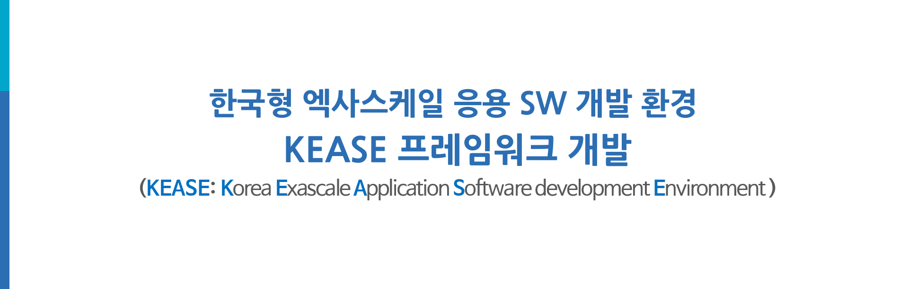

## 한국형 엑사스케일 응용 SW 개발 환경 KEASE 프레임워크 개발 

### **1. 과제개요**  
한국형 엑사스케일 응용 SW 개발 환경 (KEASE) 프레임워크 개발
본 과제는 ‘한국형 엑사스케일 응용 SW 개발 환경 (KEASE) 프레임워크 개발 (KEASE: Korea Exascale Application Software development Environment)’을 최종 목표로 ‘수치연산 커널 최적화,’‘자동 성능 최적화,’‘경량 인과관계 프로파일러,’ 그리고 ‘자원 관리 및 스케줄링’의 기술을 개발함. 이러한 기술을 모듈화하고 Kokkos와 통합함
엑사스케일 슈퍼컴퓨터 구조 및 성능에 적절한 응용 프로그램을 선택하여 모델링하고, 응용 프로그램 수준의 성능 최적화 작업을 위해 컴퓨팅 자원들의 관리 및 스케줄링을 통하여, 프로그램 실행 결과를 프로파일링하여 그 결과를 응용 프로그램의 수정 및 최적화에 반영함

---

### **1단계 연구내용**  
**[과학계산을 위한 GEMM 커널 기술]**  
 슈퍼컴퓨터 5호기 KNL 노드에 최적화된 수치 연산 커널 루틴을 개발함. GEMM/sparse BLAS/Batched BLAS 커널 개선을 통한 최적화, 데이터 전송 알고리즘 개선을 통한 최적화, 데이터 레이아웃 개선을 통한 최적화 기법을 연구함  

**[최적화를 위한 오토 튜닝 기술]**  
 슈퍼컴퓨터 5호기에서의 응용 실행 시간 예측 모델을 개발하고, 이를 통해 응용 프로그램들의 병렬화를 최적으로 구현하는 기법을 개발함. 확장성을 위한 슈퍼컴퓨터 아키텍처 추상화 및 해당 아키텍처의 성능 파라미터를 도출을 수행하며, 아키텍처 성능 파라미터를 통해 응용의 실행 시간을 예측하고, 실제 실행 결과와 비교하여 개선하는 작업을 지속적으로 수행함  

**[성능향상 예측 프로파일링 기술]**  
 슈퍼컴퓨터 5호기 KNL 단일 노드 대상 경량 인과관계 프로파일러를 개발하고, 이를 다중 노드 대상으로 확장함. 노드 간 통신으로 발생하는 off-CPU 구간 샘플링 및 virtual speedup 기법을 개발하고, HPC 응용 샘플링 오버헤드 최소화를 통한 성능 간섭 최소화 기법을 연구함  

**[자원 관리 및 스케줄링 기술]**  
 최적 자원 설정 기술 개발을 통해 슈퍼컴퓨터 5호기에서의 HPC 응용 성능 개선을 위한 클러스터 스케줄링 기술을 개발함. 스케줄링에 따른 HPC 응용의 성능 및 병렬 효율성을 분석하고, HPC 응용의 메모리/공유자원 접근 성능을 개선하기 위한 스케줄링 기법을 연구함  

---

### **2단계 연구내용**  
**[과학계산을 위한 GEMM 커널 기술]**  
 슈퍼컴퓨터 6호기 GPU에 최적화된 수치 연산 커널 루틴을 개발하고, 이를 이기종 플랫폼 시스템으로 확장함. GEMM/sparse BLAS 및 Batched BLAS 최적화 기법에 대해 연구하며, 이기종 플랫폼에서의 최적의 데이터 분배 방식 연구 및 휴리스틱 기법을 통한 자동 최적화를 수행하며, ExaMPM 및 HyPar에 적용할 수 있는 최적화 기법에 대해 연구함  

**[최적화를 위한 오토 튜닝 기술]**  
 이기종 플랫폼에서의 응용 실행 시간 예측 모델을 개발하고, 이를 통한 응용 최적화 도구를 개발함. GPU를 포함한 슈퍼컴퓨터 아키텍처 모델의 실행시간 예측 모델을 도출하고, 응용의 예상 수행 시간 및 실제 수행 시간 간의 교차 검증을 통해 실행 시간 예측 모델을 개선함  

**[성능향상 예측 프로파일링 기술]**  
 대상 시스템을 CPU 기반 클러스터에서 CPU/GPU 기반 클러스터로 확장한 인과관계 프로파일러를 개발함. GPU 연산을 포함한 virtual speedup 기반 인과관계 프로파일링 기법을 연구하고, CPU/GPU 샘플링 결과 동기화 및 병합을 통한 compute-domain 통합 인과관계 프로파일링 기법을 연구함  

**[자원 관리 및 스케줄링 기술]**  
 클러스터 환경의 이종 자원을 고려하는 HPC 응용을 위한 스케줄러를 개발함. 다중 GPU 기반 최적의 collocation 및 배치 기법 연구를 통해 이기종 플랫폼 환경을 지원하고, 다중 HPC 응용에 대한 시스템 효율을 높이는 이종 자원 스케줄링 기술을 적용하여 시스템의 성능 개선 작업을 수행함  

**[고이식성/고성능 과학계산 응용 SW 기술]**  
 고성능 과학계산 응용 SW인 Deneb를 GPU 환경과 이기종 환경으로 포팅하여, 이기종 시스템에서 동작할 수 있도록 확장함. 궁극적으로 Kokkos 환경으로 이식하여, 컴퓨터 아키텍처에 무관하게 최적화된 성능을 낼 수 있는 고이식성을 확보함. 이 과정에서 타 세부에서 개발한 최적화 기술들을 적용하고 그 효과성을 검증함  

---

### **2. 연구팀 세부과제 연계성**
[]

---

### **3. 프레임워크**
[]

---

### **4. 2차년도 연구 목표**
[]

---

### **5. 연구팀 / 연구 기관 및 연구 내용**
[.png)]

---

### **6. 연차별 연구내용**
[]

---

### **1. 논문 - (최)우수학술대회 - 국외**

| 번호 | 게재연월 | 논문제목 | 총저자명 | 출처 | 학술지명 | 권(호) | 학술지구분 | SCI여부 | IF | 국제공동연구논문여부 | 기여도 | 링크 |
|------|---------|---------|---------|------|---------|--------|-----------|---------|----|--------------------|-------|------|
| 1    | 202406   | Fully Harnessing the Performance Potential of DRAM-less Mobile Flash Storage   | 노재선 이규선 김영석 정진규         | IEEE            | IEEE Inter Conf on Massive Storage Systems and Technology (MSST) | -      | -          | 예      | 1    | N                   | 50     | [🔗](First_data/1-2-1%20(최)우수국외학술대회_MSST2024_4.pdf) |
| 2    | 202407   | Identifying On-/Off-CPU Bottlenecks Together with Blocked Samples             | 안민우 한정민 권영진 정진규         | -               | 18th USENIX Symposium on Operating Systems Design and Implementation (OSDI 24) | -      | -          | 예      | 4    | N                   | 100    | [🔗](First_data/1-2-2%20(최)우수국외학술대회_USENIX2024_1.pdf) |
| 3    | 202407   | A Secure, Fast, and Resource-Efficient Serverless Platform with Function REWIND | 송재현 김범석 곽민우 이병영 서의성 정진규 | -               | 2024 USENIX Annual Technical Conference (USENIX ATC 24)       | -      | -          | 예      | 3    | N                   | 50     | [🔗](First_data/1-2-3%20(최)우수국외학술대회_USENIX2024_2.pdf) |
| 4    | 202410   | Cloud Reamer: Enabling Inference Services in Training Clusters                | Osama Khan 유준열 박관종 서의성     | IEEE            | The Modeling, Analysis, and Simulation of Computer and Telecommunication System (MASCOTS) | -      | -          | 예      | 2    | N                   | 50     | [🔗](First_data/1-2-4%20(최)우수국외학술대회_MASCOTS2024.pdf) |
| 5    | 202504   | Transparent Smartphone Memory Expansion                                        | 이규선 박진용 이재욱 정진규         | -               | The 40th ACM/SIGAPP Symposium On Applied Computing             | -      | -          | 예      | 1    | N                   | 50     | [🔗](First_data/1-2-5%20(최)우수국외학술대회_SIGAPP2025.pdf) |

---

### **2. 논문 - 국외논문지(SCI)**

| 번호 | 게재연월  | 논문제목                                                          | 총저자명                               | 출처            | 학술지명                    | 권(호)  | 학술지구분 | SCI여부 | IF   | mrnIF  | 국제공동연구 | 기여도 | 링크                |
|------|-----------|-------------------------------------------------------------------|----------------------------------------|-----------------|-----------------------------|---------|------------|---------|------|--------|--------------|--------|---------------------|
| 1    | 2023.12   | HypGB: High Accuracy GB Classifier for Predicting Heart Disease with HyperOpt HPO Framework and LASSO FS Method | Abbas Jafar, Myungho Lee               | -               | IEEE Access                | 11()    | Q1         | SCI     | 3.4  | 63.869 | N            | 100    | [🔗](https://example.com) |
| 2    | 2024.05   | Learning font-style space using style-guided discriminator for few-shot font generation | Ammar Ul Hassan, Irfanullah Memon, Jaeyoung Choi | -               | Expert Systems with Applications | Vol.242 | Q1         | SCI     | 8.5  | 90.502 | N            | 100    | [🔗](https://example.com) |
| 3    | 2024.07   | Revisiting the Performance Optimization of QR Factorization on Intel KNL and SKL Multiprocessors | Muhammad Rizwan, Enoch Jung, Jongsun Choi, Jaeyoung Choi | -               | Journal of Supercomputing  | Vol.80(10) | Q2         | SCI     | 3.3  | 60.377 | N            | 100    | [🔗](https://example.com) |
| 4    | 2024.07   | High Accuracy COVID-19 Prediction Using Optimized Union Ensemble Feature Selection Approach | Abbas Jafar, Myungho Lee               | -               | IEEE Access                | 12()    | Q1         | SCI     | 3.4  | 63.869 | N            | 100    | [🔗](https://example.com) |

---

### **3. 논문 - 국내논문지**

| 번호 | 게재연월 | 논문제목                                        | 총저자명                    | 출처         | 학술지명                  | 권(호)     | 학술지구분 | SCI여부 | IF   | 국제공동연구논문여부 | 기여도 | 링크                |
|------|----------|-------------------------------------------------|-----------------------------|--------------|--------------------------|------------|------------|---------|------|---------------------|--------|---------------------|
| 1    | 2024.10  | 웹GPU와 웹어셈블리를 이용한 이미지 프로세싱 가속  | 남현우 이명호 박능수         | -            | 정보처리학회 논문지        | 13(10)     | KCI 등재지 | 아니오  | -    | 아니오              | 100    | [🔗](https://example.com) |
| 2    | 2025.03  | bperf, BCOZ를 활용한 응용의 On-CPU, Off-CPU 동시 성능 프로파일링 | 안민우 정진규                | -            | 정보과학회지 특집원고      | 0(0)       | -          | 아니오  | -    | 아니오              | 100    | [🔗](https://example.com) |

---

### **4. 논문 - 국외 학술대회**

| 번호 | 게재연월   | 논문제목                                                                  | 총저자명                 | 출처                                  | 학술대회명                                           | 권(호) | 학술지구분 | SCI여부 | IF  | 국제공동연구 여부 | 기여도 | 링크                |
|------|------------|---------------------------------------------------------------------------|--------------------------|---------------------------------------|-----------------------------------------------------|--------|------------|---------|-----|------------------|--------|---------------------|
| 1    | 2024.07.19 | Optimizing GEMM routine with Data Preloading on Marvell ThunderX2         | 정에녹 최재영             | -                                     | 15th International Conference on Mechanical and Aerospace Engineering (ICMAE 2024) | -      | -          | N       | -   | N                | 100    | [🔗](https://example.com) |
| 2    | 2024.09.04 | Persistent Memory I/O-Aware Task Placement for Mitigating Resource Contention | 안현우 김종석 서의성     | ACM                                   | SIGOPS Asia-Pacific Workshop on Systems (APSYS)     | -      | -          | N       | -   | N                | 50     | [🔗](https://example.com) |

---

### **5. 논문 - 국내 학술대회**

| 번호 | 게재연월   | 논문제목                                                                 | 총저자명                    | 학술지명                              | 국제공동연구 여부 | 기여도 | 링크                |
|------|------------|--------------------------------------------------------------------------|-----------------------------|---------------------------------------|------------------|--------|---------------------|
| 1    | 202405     | Optimizing GEMM routine with Data Preloading on ARM ThunderX2            | 정에녹 최재영                | 2024 한국계산과학공학회 춘계학술발표대회    | N                | 100    | [🔗](https://example.com) |
| 2    | 202405     | CUDA 기반 숄레스키 분해 성능 최적화 환경 탐색                           | 강준범 이명호 박능수         | 한국정보처리학회 ASK 2024 학술발표대회 | N                | 100    | [🔗](https://example.com) |
| 3    | 202405     | 웹 표준 기반 고성능 이미지 프로세싱 기술 연구                           | 남현우 이명호 박능수         | 한국정보처리학회 ASK 2024 학술발표대회 | N                | 100    | [🔗](https://example.com) |
| 4    | 202409     | Porting HPCG to Kokkos for Enhanced Portability and Performance          | Muhammad Rizwan 최재영       | 2024 한국계산과학공학회 추계학술대회       | N                | 100    | [🔗](https://example.com) |
| 5    | 202409     | Fast and Accurate COVID-19 Prediction with Optimized Machine Learning Approach | Abbas Jafar 이명호         | 2024 한국계산과학공학회 추계학술대회       | N                | 100    | [🔗](https://example.com) |
| 6    | 202409     | Performance Analysis of HPCG Benchmark                                    | 안민우 김나연 빅준규 정진규 | 2024 한국계산과학공학회 추계학술대회       | N                | 100    | [🔗](https://example.com) |
| 7    | 202409     | Cloud Reamer: Enabling Inference Services in Training Clusters           | Osama Khan 박관종 유준렬 서의성 | 2024 한국계산과학공학회 추계학술대회       | N                | 100    | [🔗](https://example.com) |
| 8    | 202410     | 웹 실행 코드 타입에 따른 행렬 곱셈 성능 평가                           | 남현우 이명호 박능수         | 한국정보처리학회 ACK 2024             | N                | 100    | [🔗](https://example.com) |
| 9    | 202410     | KOKKOS 환경에서의 병렬 숄레스키 분해 구현                              | 강준범 이명호 박능수         | 한국정보처리학회 ACK 2024             | N                | 50     | [🔗](https://example.com) |
| 10   | 202412     | 스레드 배치 방식이 매니코어 프로세서의 성능에 미치는 영향             | 이정주 이명호                | 2024 한국소프트웨어 종합학술대회           | N                | 100    | [🔗](https://example.com) |

### **6. 워크샵 개최**

| 번호 | 워크샵연월  | 워크샵명                             | 학술대회명                                 | 행사장소 | 참가자수 | 링크 |
|------|------------|-------------------------------------|------------------------------------------|----------|----------|-----|
| 1    | 2024.06.27 | 초고성능응용SW 프레임워크개발워크숍 | 2024 한국컴퓨터 종합학술대회 (KCC 2024)    | ICC 제주 | 30       | [🔗](https://example.com) |

---

### **7. 보고서 원문**

| 번호 | 보고서 제목                                               | 발간일    | 작성기관      | 등록 번호                     | 링크 |
|------|--------------------------------------------------------|-----------|---------------|-------------------------------|-----|
| 1    | GEMM 커널 최적화                                          | 2024.04.20 | 숭실대학교     | KEASE 프로젝트 기술서 24-1    | [🔗](https://example.com) |
| 2    | Kokkos 프레임워크에서 ExaMPM 테스트                       | 2024.04.20 | 숭실대학교     | KEASE 프로젝트 기술서 24-2    | [🔗](https://example.com) |
| 3    | 슈퍼컴퓨터 5호기의 성능모델 및 프로그램 실행시간 예측모델 개발 | 2024.04.20 | 명지대학교     | KEASE 프로젝트 기술서 24-3    | [🔗](https://example.com) |
| 4    | 단일 컴퓨팅 노드 대상 경량 인과관계 프로파일러            | 2024.04.20 | 연세대학교     | KEASE 프로젝트 기술서 24-4    | [🔗](https://example.com) |
| 5    | CPU 기반 HPC 응용을 위한 최적 자원 설정 기술             | 2024.04.20 | 성균관대학교   | KEASE 프로젝트 기술서 24-5    | [🔗](https://example.com) |
| 6    | GEMM 커널 최적화 2                                        | 2024.12.31 | 숭실대학교     | KEASE 프로젝트 기술서 25-1    | [🔗](https://example.com) |
| 7    | HPCG Benchmark -A Comprehensive Survey-                   | 2024.12.31 | 숭실대학교     | KEASE 프로젝트 기술서 25-2    | [🔗](https://example.com) |
| 8    | Exploring Variants of SymGS Algorithms in HPCG             | 2025.03.10 | 숭실대학교     | KEASE 프로젝트 기술서 25-3    | [🔗](https://example.com) |
| 9    | 슈퍼컴퓨터 5호기의 메모리 성능 최적화 및 가속기 상에서의 응용 프로그램 성능 최적화 | 2025.03.10 | 명지대학교     | KEASE 프로젝트 기술서 25-4    | [🔗](https://example.com) |
| 10   | 멀티 프로세스 응용 지원 경량 인과관계 프로파일러         | 2025.03.10 | 연세대학교     | KEASE 프로젝트 기술서 25-5    | [🔗](https://example.com) |
| 11   | 메모리/공유자원 접근 최적화 및 응용 SW 워크로드 스케줄링 최적화 기술 | 2025.03.10 | 성균관대학교   | KEASE 프로젝트 기술서 25-6    | [🔗](https://example.com) |

---

### **8. 지식재산권 (국제특허)**

| 번호 | 지식재산권 등 명칭(건별 각각 기재)                                             | 국명  | 출원인                             | 출원일    | 출원번호  | 등록번호 | 등록인 | 등록일 | 등록번호 | 기여율 | 활용여부 | 링크 |
|------|--------------------------------------------------------------------------|-------|-----------------------------------|-----------|-----------|----------|--------|--------|----------|--------|----------|----|
| 1    | DEVICE AND METHOD FOR IMPROVING APPLICATION PERFORMANCE BASED ON BLOCK SAMPLES | 미국  | 연세대학교 산학협력단                | 2024.10.31 | 18/933709 | -        | -      | -      | -        | 30     | 미활용    | [🔗](https://example.com) |
| 2    | CHECKPOINT AND REWIND METHOD AND APPARATUS IN SERVERLESS PLATFORM            | 미국  | 연세대학교 산학협력단, 성균관대학교 산학협력단 | 2024.12.09 | 18/974346 | -        | -      | -      | -        | 50     | 미활용    | [🔗](https://example.com) |

---

### **9. 지식재산권(국내특허)**

| 번호 | 지식재산권 등 명칭                         | 국명   | 출원인                              | 출원일    | 출원번호      | 등록번호 | 등록인 | 등록일 | 등록번호 | 기여율 | 활용여부 | 링크 |
|------|--------------------------------------|--------|-----------------------------------|-----------|--------------|----------|--------|--------|----------|--------|----------|-----|
| 1    | 심장질환 예측모델 구축 시스템 및 방법         | 대한민국 | 명지대학교 산학협력단                   | 2024.10.04 | 10-2024-0134882 | -        | -      | -      | -        | 100    | 미활용    | [🔗](https://example.com) |
| 2    | 블록 샘플 기반의 애플리케이션 성능 개선 장치 및 방법 | 대한민국 | 연세대학교 산학협력단                    | 2024.10.24 | 10-2024-0146875 | -        | -      | -      | -        | 30     | 미활용    | [🔗](https://example.com) |
| 3    | 서버리스 플랫폼에서의 체크포인트 및 리와인드 방법 및 장치 | 대한민국 | 연세대학교 산학협력단, 성균관대학교 산학협력단 | 2024.05.21 | 10-2024-0065783 | -        | -      | -      | -        | 50     | 미활용    | [🔗](https://example.com) |

---

### **10. 저작권(소프트웨어, 서적 등)**

| 번호 | 저작권명                                                   | 창작일    | 저작자명         | 등록일    | 등록 번호        | 저작권자명         | 기여율 | 링크 |
|------|--------------------------------------------------------|-----------|------------------|-----------|------------------|-------------------|--------|----|
| 1    | Kokkos(코코스) 기반 애플리케이션을 위한 시스템 프로파일링 도구 | 2024.03.21 | 성균관대학교 산학협력단 | 2024.04.12 | C-2024-013438     | 성균관대학교 산학협력단 | 100    | [🔗](https://example.com) |
| 2    | 고정밀 코비드-19 예측기                                    | 2024.07.31 | 명지대학교 산학협력단 | 2025.02.14 | C-2025-005935     | 명지대학교 산학협력단 | 100    | [🔗](https://example.com) |
| 3    | 하이퍼지비(HypGB)                                         | 2024.07.31 | 명지대학교 산학협력단 | 2025.02.14 | C-2025-005936     | 명지대학교 산학협력단 | 100    | [🔗](https://example.com) |
| 4    | 멀티 프로세스 응용 지원 인과관계 프로파일러               | 2025-02-25 | 연세대학교 산학협력단 | 2025.03.10 | C-2025-008825     | 연세대학교 산학협력단 | 100    | [🔗](https://example.com) |
| 5    | CPU 환경 OpenMP 라이브러리 기반 적응형 스케줄링을 위한 지원 도구 | 2025.03.05 | 성균관대학교 산학협력단 | (등록중)  | 2025-010705 (접수번호) | 성균관대학교 산학협력단 | 100    | [🔗](https://example.com) |
| 6    | SPMV/SYMGS 커널생성기                                      | 2025.03.10 | 숭실대학교 산학협력단 | (등록중)  | -                | 숭실대학교 산학협력단 | 100    | [🔗](https://example.com) |
